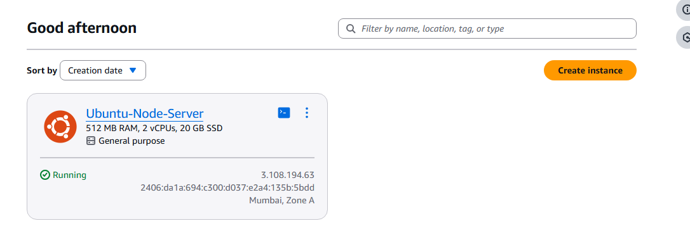

# AWS Lightsail: Manual Node.js Deployment on Ubuntu

This project demonstrates a professional **IaaS (Infrastructure as a Service)** deployment. Unlike managed "Serverless" solutions, this repository documents the manual configuration of a Virtual Private Server (VPS), starting from a raw Operating System.

## 🏗️ Architecture Overview
While managed services (like App Runner) abstract away the server, this project showcases my ability to manage the **OS (Ubuntu)** directly. I am responsible for the server's security, runtime installation, and process persistence.

**Live Project URL:** `http://3.108.194.63:8080`

---

## 🛠️ Step-by-Step Implementation

### 1. OS Provisioning & Networking
* **OS:** Ubuntu 22.04 LTS (LTS ensures stability).
* **Firewall:** Manually opened **Port 8080** via the Lightsail networking console to allow inbound TCP traffic.
* **IP Management:** Attached a **Static IP** to ensure the application address remains permanent.

### 2. Environment Configuration (Terminal)
Accessed the instance via **SSH** to manually install the required technical stack:
* **Node.js 18:** Installed via NodeSource repository.
* **Git:** Installed to bridge the gap between GitHub and the Linux server.

### 3. Application Deployment
Instead of an automated trigger, I performed a manual "Pull" strategy:
1. Cloned the repository directly into the Ubuntu home directory.
2. Ran `npm install` to build dependencies within the Linux environment.

### 4. Production Process Management (PM2)
To ensure the app survives crashes and server reboots, I implemented **PM2**:
* Configured PM2 to monitor the `index.js` process.
* Generated and saved a startup script to the Linux `systemd` manager.

---

## 📊 Deployment Evidence

### Process Monitoring (PM2)
The screenshot below confirms that the application is running as a background process within the Ubuntu OS.

### Firewall Rules
Evidence of custom networking rules allowing traffic to bypass the Ubuntu server's security layer on port 8080.

### Live Instance
The running instance details showing the Mumbai region and the assigned Static IP.

---

## 🧠 Key Takeaways: Service vs. Server
* **App Runner (Service):** Focused on code; AWS handles the OS.
* **Lightsail (Server):** Focused on control; I handled the OS, security, and runtime installation.

**Skills Proven:** Linux CLI, SSH, PM2, Cloud Networking, Git Version Control.
